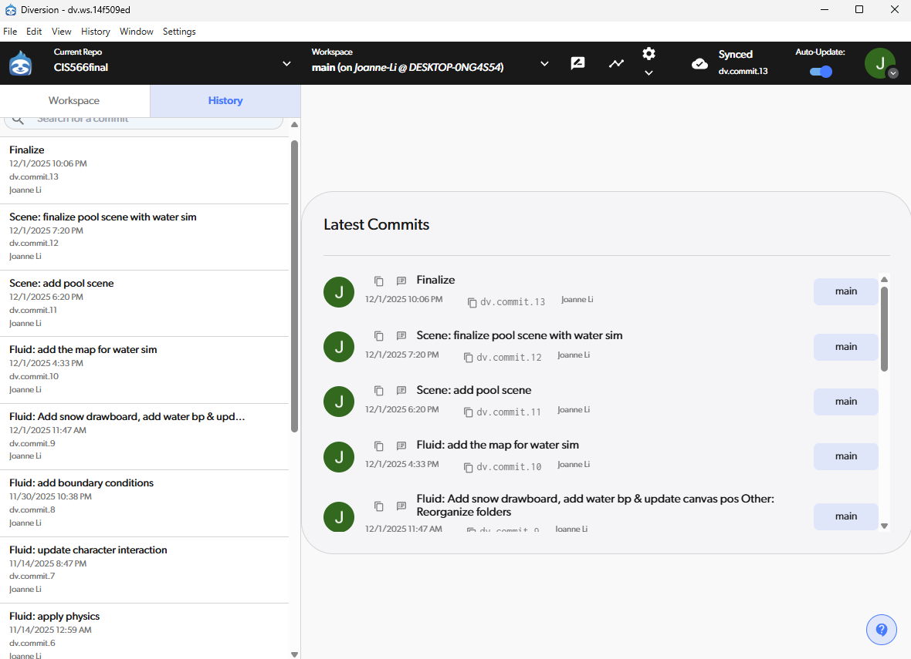

# Interactive water surface with fluid simulation

This project features an interactive water surface that reacts in real time to objects and characters, using a custom fluid simulation and water shader.

This project used a Diversion repo to keep track of changes. All Unreal files have been added to the main GitHub repo for submission.

## Design Doc
### Introduction
This project presents a post-apocalyptic environment in a game level built in Unreal Engine, where the player stands on physically simulated water that reacts in real time to movement and interaction. Surrounding environment includes procedurally generated buildings and ruins. Together, the project demonstrates the integration of real-time physics, particle system and procedural generation to build a visually appealing game scene.

### Goal
To create an immersive **Unreal Engine game level** that demonstrates **real-time fluid simulation**, **procedural environment generation**, and **realistic visual effects** in a post-apocalyptic setting.

### Inspiration/reference:
The motivation is the ink water effect of the fighting scene in Black Myth: Wukong.

Instead of the ink water, we decided to make an oily surface. 

[Found on Game Dev Stack Exchange](https://gamedev.stackexchange.com/questions/64613/rendering-oily-polluted-water)

[Concept Art by Sean Bodley](https://seanbodley.artstation.com/projects/mq2xaa)

Visual concepts for scene construction:
|  |  |
| ----------- | ----------- |

### Specification:
- Custom-built wasteland city scene from scratch
- Fluid simulation implemented using the Niagara system
- Oily surface shading on the water
- Procedurally generated buildings and objects for scene construction
- Additional effects such as falling ash and volumetric smoke if time permits

### Techniques:
- **Fluid sim:** Niagara Grid2D
- **Procedural generation:** Houdini->Unreal using Houdini Engine
- **Falling ash / other interactive objects:** Niagara particles

There are many tutorials online, and here's some of them that might be useful:  
[Exploring Unreal Engine 5 Niagara Simulation Stages and Grid2D Collection](https://www.youtube.com/watch?v=PCA5jQwFvug)  
[PROJECT TITAN BUILDING TOOL](https://www.sidefx.com/tutorials/project-titan-building-tool/)

### Design:

### Timeline:

| Timeline | Team Goal | McKenna | Joanne |
| ----------- | ----------- | ----------- | ----------- |
| Nov 5 - Nov 12 | A basic Unreal game level, Houdini to Unreal pipeline setup | Set up Houdini to Unreal pipeline & Begin asset creation | Grid2D setup and basic fluid physics |
| Nov 12 - Nov 19 | Finish the scene layout with basic buildings, add the water surface in the level that can be interacted with the character | Finish asset creation & Create procedural buildings using assets | Make the fluid interactable | 
| Nov 19 - Nov 26 | All models are done, basic materials applied | Add vegetation, destruction, etc. to buildings for wasteland effect | Refine fluid physics, start to work on oily water surface shading | 
| Nov 26 - Dec 1 | A complete game level with nice shading | Implement particle system for ash/smoke/other if all other parts are working correctly | Refinement | 

Submit your Design doc as usual via pull request against this repository.

## Milestone 1
### General:
- Created a basic Unreal game level

### Fluid sim (Joanne):
- Created a basic Niagara system
- Implemented an emitter with grid2D, with simple simulation and rendering - writes the updated color at each frame to a render rarget and renders on screen.
- Can update the grid cell's velocity based on a texture input

  

### Procedural generation (McKenna):
Got Houdini Engine pipeline set up on laptop, tried dragging in .hda file from procedural building and it seemed to work because the Houdini logo showed up as a placeholder but when the file is open, no building shows up. I'll have to look more into this for the next checkpoint. For now, I am working on creating assets for the procedural wasteland city. Pictured below is a building made with the current procedural setup I have in Houdini, based off of [this tutorial](https://www.youtube.com/watch?v=PfcbekTodWw) on the Houdini YouTube channel. The procedural generation for the building itself is setup, just need to add procedural windows and have the presence of window panes be procedural as well. Then put into Unreal and make multiple buildings in the area with different seeds.

## Milestone 2
Because we couldn’t get Houdini Engine to work in Unreal, we decided to separate and work on our own projects instead. I (Joanne) continued developing the fluid simulation in this repo.

### New Goal:
Originally, McKenna worked on the game-level scene development. Since we split the project, I shifted my goal from creating a wasteland-style city to building a simple pool scene to showcase the water-surface simulation.

### Fluid Sim:
- More physics: calculate divergence and pressure, and apply to velocity.

  

- Character interaction

  

## Final submission
### Fluid Sim:
- Added boundary conditions to prevent sampling color from the opposite side.
- Refined physics to make it more stable.
- Enabled multiple objects to interact with the fluid.

  
  

### Shading:
- The Niagara system outputs a texture representing the velocity field. To shade the water, I used the velocity field to compute the base color, normals, and refraction.
- By applying velocity-based distortion to the normals, the water displays wave motion without vertex displacement, which is very cheap and performs well in real time.

  

### Scene:
- I downloaded a pool scene and applied my water simulation to its water surface.

  

### Post mortem: how did your project go overall? Did you accomplish your goals? Did you have to pivot?

I’m happy with the final result, even though it’s very different from the original plan. McKenna and I had to pivot because Houdini Engine just wouldn’t work for us. As a result, we ended up doing separate projects. Although the final scene doesn’t match the initial idea, I completed the fluid simulation and applied it to a convincing water-surface material.

I finished the physics for the fluid simulation, and it works quite well. I didn’t have enough time to refine the water shading with the oil shader, and since I wasn’t building the wasteland city anymore, I decided to go with a pure water shader instead.