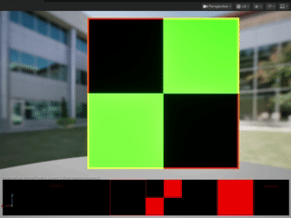

### Design Doc
#### Introduction
This project presents a post-apocalyptic environment in a game level built in Unreal Engine, where the player stands on physically simulated water that reacts in real time to movement and interaction. Surrounding environment includes procedurally generated buildings and ruins. Together, the project demonstrates the integration of real-time physics, particle system and procedural generation to build a visually appealing game scene.

#### Goal
To create an immersive **Unreal Engine game level** that demonstrates **real-time fluid simulation**, **procedural environment generation**, and **realistic visual effects** in a post-apocalyptic setting.

#### Inspiration/reference:
The motivation is the ink water effect of the fighting scene in Black Myth: Wukong.

Instead of the ink water, we decided to make an oily surface. 

[Found on Game Dev Stack Exchange](https://gamedev.stackexchange.com/questions/64613/rendering-oily-polluted-water)

[Concept Art by Sean Bodley](https://seanbodley.artstation.com/projects/mq2xaa)

Visual concepts for scene construction:
|  |  |
| ----------- | ----------- |

#### Specification:
- Custom-built wasteland city scene from scratch
- Fluid simulation implemented using the Niagara system
- Oily surface shading on the water
- Procedurally generated buildings and objects for scene construction
- Additional effects such as falling ash and volumetric smoke if time permits

#### Techniques:
- **Fluid sim:** Niagara Grid2D
- **Procedural generation:** Houdini->Unreal using Houdini Engine
- **Falling ash / other interactive objects:** Niagara particles

There are many tutorials online, and here's some of them that might be useful:  
[Exploring Unreal Engine 5 Niagara Simulation Stages and Grid2D Collection](https://www.youtube.com/watch?v=PCA5jQwFvug)  
[PROJECT TITAN BUILDING TOOL](https://www.sidefx.com/tutorials/project-titan-building-tool/)

#### Design:

#### Timeline:

| Timeline | Team Goal | McKenna | Joanne |
| ----------- | ----------- | ----------- | ----------- |
| Nov 5 - Nov 12 | A basic Unreal game level, Houdini to Unreal pipeline setup | Set up Houdini to Unreal pipeline & Begin asset creation | Grid2D setup and basic fluid physics |
| Nov 12 - Nov 19 | Finish the scene layout with basic buildings, add the water surface in the level that can be interacted with the character | Finish asset creation & Create procedural buildings using assets | Make the fluid interactable | 
| Nov 19 - Nov 26 | All models are done, basic materials applied | Add vegetation, destruction, etc. to buildings for wasteland effect | Refine fluid physics, start to work on oily water surface shading | 
| Nov 26 - Dec 1 | A complete game level with nice shading | Implement particle system for ash/smoke/other if all other parts are working correctly | Refinement | 

Submit your Design doc as usual via pull request against this repository.

## Milestone 1
### General:
- Created a basic Unreal game level

### Fluid sim (Joanne):
- Created a basic Niagara system
- Implemented an emitter with grid2D, with simple simulation and rendering - writes the updated color at each frame to a render rarget and renders on screen.
- Can update the grid cell's velocity based on a texture input

  

### Procedural generation (McKenna):
Got Houdini Engine pipeline set up on laptop, tried dragging in .hda file from procedural building and it seemed to work because the Houdini logo showed up as a placeholder but when the file is open, no building shows up. I'll have to look more into this for the next checkpoint. For now, I am working on creating assets for the procedural wasteland city. Pictured below is a building made with the current procedural setup I have in Houdini, based off of [this tutorial](https://www.youtube.com/watch?v=PfcbekTodWw) on the Houdini YouTube channel. The procedural generation for the building itself is setup, just need to add procedural windows and have the presence of window panes be procedural as well. Then put into Unreal and make multiple buildings in the area with different seeds.

## Milestone 2: Implementation part 2 (due 11/24)

### Fluid Sim (Joanne):
- More physics: calculate divergence and pressure, and apply to velocity.

  

- Character interaction

  

## Final submission (due 12/1)
Time to polish! Spen this last week of your project using your generator to produce beautiful output. Add textures, tune parameters, play with colors, play with camera animation. Take the feedback from class critques and use it to take your project to the next level.

Submission:
- Push all your code / files to your repository
- Come to class ready to present your finished project
- Update your README with two sections 
  - final results with images and a live demo if possible
  - post mortem: how did your project go overall? Did you accomplish your goals? Did you have to pivot?

## Topic Suggestions

### Create a generator in Houdini

### A CLASSIC 4K DEMO
- In the spirit of the demo scene, create an animation that fits into a 4k executable that runs in real-time. Feel free to take inspiration from the many existing demos. Focus on efficiency and elegance in your implementation.
- Example: 
  - [cdak by Quite & orange](https://www.youtube.com/watch?v=RCh3Q08HMfs&list=PLA5E2FF8E143DA58C)

### A RE-IMPLEMENTATION
- Take an academic paper or other pre-existing project and implement it, or a portion of it.
- Examples:
  - [2D Wavefunction Collapse Pokémon Town](https://gurtd.github.io/566-final-project/)
  - [3D Wavefunction Collapse Dungeon Generator](https://github.com/whaoran0718/3dDungeonGeneration)
  - [Reaction Diffusion](https://github.com/charlesliwang/Reaction-Diffusion)
  - [WebGL Erosion](https://github.com/LanLou123/Webgl-Erosion)
  - [Particle Waterfall](https://github.com/chloele33/particle-waterfall)
  - [Voxelized Bread](https://github.com/ChiantiYZY/566-final)

### A FORGERY
Taking inspiration from a particular natural phenomenon or distinctive set of visuals, implement a detailed, procedural recreation of that aesthetic. This includes modeling, texturing and object placement within your scene. Does not need to be real-time. Focus on detail and visual accuracy in your implementation.
- Examples:
  - [The Shrines](https://github.com/byumjin/The-Shrines)
  - [Watercolor Shader](https://github.com/gracelgilbert/watercolor-stylization)
  - [Sunset Beach](https://github.com/HanmingZhang/homework-final)
  - [Sky Whales](https://github.com/WanruZhao/CIS566FinalProject)
  - [Snail](https://www.shadertoy.com/view/ld3Gz2)
  - [Journey](https://www.shadertoy.com/view/ldlcRf)
  - [Big Hero 6 Wormhole](https://2.bp.blogspot.com/-R-6AN2cWjwg/VTyIzIQSQfI/AAAAAAAABLA/GC0yzzz4wHw/s1600/big-hero-6-disneyscreencaps.com-10092.jpg)

### A GAME LEVEL
- Like generations of game makers before us, create a game which generates an navigable environment (eg. a roguelike dungeon, platforms) and some sort of goal or conflict (eg. enemy agents to avoid or items to collect). Aim to create an experience that will challenge players and vary noticeably in different playthroughs, whether that means procedural dungeon generation, careful resource management or an interesting AI model. Focus on designing a system that is capable of generating complex challenges and goals.
- Examples:
  - [Rhythm-based Mario Platformer](https://github.com/sgalban/platformer-gen-2D)
  - [Pokémon Ice Puzzle Generator](https://github.com/jwang5675/Ice-Puzzle-Generator)
  - [Abstract Exploratory Game](https://github.com/MauKMu/procedural-final-project)
  - [Tiny Wings](https://github.com/irovira/TinyWings)
  - Spore
  - Dwarf Fortress
  - Minecraft
  - Rogue

### AN ANIMATED ENVIRONMENT / MUSIC VISUALIZER
- Create an environment full of interactive procedural animation. The goal of this project is to create an environment that feels responsive and alive. Whether or not animations are musically-driven, sound should be an important component. Focus on user interactions, motion design and experimental interfaces.
- Examples:
  - [The Darkside](https://github.com/morganherrmann/thedarkside)
  - [Music Visualizer](https://yuruwang.github.io/MusicVisualizer/)
  - [Abstract Mesh Animation](https://github.com/mgriley/cis566_finalproj)
  - [Panoramical](https://www.youtube.com/watch?v=gBTTMNFXHTk)
  - [Bound](https://www.youtube.com/watch?v=aE37l6RvF-c)

### YOUR OWN PROPOSAL
- You are of course welcome to propose your own topic . Regardless of what you choose, you and your team must research your topic and relevant techniques and come up with a detailed plan of execution. You will meet with some subset of the procedural staff before starting implementation for approval.
